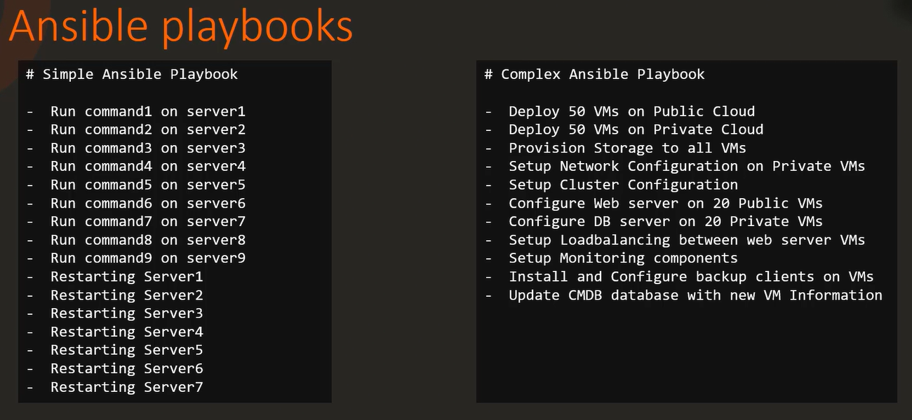

# Let's Learn and Build Something using Ansible

# Learning notes - concepts

## Introduction, Configuration and Basic tasks.
### Why Ansible?
- Provisioning
- Configuration Management
- Continuous Delivery
- Application Deployment
- Secuirty Compliance

Use Case 01:
Suppose we have number of servers in the environment(Web Server, App Server, Database)
We want to power down the server in WEB->APP>DB
Power up DB->APP->WEB using ansible playbooks.

User Case 02:
Suppose we have 1000s of server and we want to install, configure and manage the configuration of the server, we can use ansible becase of number of modules available to do it.

## Configuration Files
When we install the Ansible it creates default configuration file in location: /etc/ansible/ansible.cfg

```shell
/etc/ansible/ansible.cfg
[defaults]
inventory           = /etc/ansible/hosts

[inventory]

[priviledge_escalation]

[ssh_connection]
```

## Ansible Inventory
```shell
/etc/ansible/hosts
[web]
ansible_host=server1.example.com ansible_connection=ssh ansible_user=root
server2.example.com
[app]
server3.example.com
server4.example.com
[db]
server5.example.com
server6.example.com
```
### Ansible INI Format
```shell
[webservers]
web1.example.com
web2.example.com
[dbservers]
db1.example.com
db2.example.com
```

### Ansible YAML Format
```shell
all:
  children:
    webservers:
      hosts:
        web1.example.com:
        web2.example.com:
    dbservers:
      hosts:
        db1.example.com:
        db2.example.com:
```

### Inventory Example:
```yaml
[bob@student-node playbooks]$ cat inventory 
# Sample Inventory File

# Web Servers
web1 ansible_host=server1.company.com ansible_connection=ssh ansible_user=root ansible_ssh_pass=Password123!
web2 ansible_host=server2.company.com ansible_connection=ssh ansible_user=root ansible_ssh_pass=Password123!
web3 ansible_host=server3.company.com ansible_connection=ssh ansible_user=root ansible_ssh_pass=Password123!
db1  ansible_host=server3.company.com ansible_connection=winrm ansible_user=administrator ansible_password=Dbp@ss123!
```

## Ansible Variables and Facts
- Variables stores information that varies with each host.
- Jinja2 templating 
- Precedence
  ○ Group Vars
  ○ Host Vars
  ○ Host Facts
  ○ Play Vars
  ○ Role Vars
  ○ Include Vars
  ○ Set Facts
  ○ Extra facts
### Variable Scope

## Ansible Playbooks


### What is Playbook?
- Playbook - A playbook YAML file (playbook.yml)
    - Play - Defines a set of activities(tasks) to be run on hosts
        - Task - An action to be performed on the host
            - Execute a command
            - Execute a script
            - Install a package
            - Shutdown/Restart
- Ansible modules are units of code that can control system resources or execute system commands. Ansible provides a module library that you can execute directly on remote hosts or through playbooks. You can also write custom modules.

```shell
---
- name: Samnple Playbook 
  hosts: localhost
  tasks:
    - name: Execute command 'date'
      command: date

    - name: Execute script on the server
      script: test_script.sh

    - name: Install httpd service
      yum:
        name: httpd
        state: present
    
    - name: Start web server
      service: 
        name: httpd
        state: started
```
### How to varify Playbooks in Ansible?
```shell
ansible-playbook install_nginx.yml --syntax-check
ansible-playbook install_nginx.yml --check
ansible-playbook install_nginx.yml --check --diff
```

### Ansible lint (ansible-lint)
```shell
ansible-lint style_playbook.yml
```

### Ansible Conditionals
### Conditional - When
```yaml
---
- name: Install NGINX
  hosts: all
  tasks:
  - name: Install NGINX on Debian
    apt: 
      name: nginx
      state: present
    when: ansible_os_family == "Debian"
  - name: Install NGINX on Redhat
    yum: 
      name: nginx
      state: present
    when: ansible_os_family == "Redhat"
```
### Operator - or
```yaml
---
- name: Install NGINX
  hosts: all
  tasks:
  - name: Install NGINX on Debian
    apt: 
      name: nginx
      state: present
    when: ansible_os_family == "Debian"
  - name: Install NGINX on Redhat
    yum: 
      name: nginx
      state: present
    when: ansible_os_family == "Redhat" or ansible_os_family == "SUSE"
```
### Operator - and
```yaml
---
- name: Install NGINX
  hosts: all
  tasks:
  - name: Install NGINX on Debian
    apt: 
      name: nginx
      state: present
    when: ansible_os_family == "Debian" and ansible_distribition_version == "16.04"
  - name: Install NGINX on Redhat
    yum: 
      name: nginx
      state: present
    when: ansible_os_family == "Redhat" or ansible_os_family == "SUSE"
```
### Conditionals in Loops
```yaml
---
- name: Install Softwares
  hosts: all
  vars: 
    packages:
      - name: nginx
        required: True
      - name: mysql
        required: True
      - name: apache
        required: False
  tasks:
  - name: Install "{{ item.name }}" on Debian
    apt: 
      name: {{ item.name }}
      state: present
    when: item.required = True
    loop: "{{ packages }}"
```
### Conditionals & Register
```yaml
---
- name: Check Status of a service and email if its down
  hosts: localhost
  tasks:
  - name: Check status of a service
    command: service httpd status
    register: result
  - mail: 
      to: admin@example.com
      subject: Service Alert
      body: Httpd Service is down

      when: result.stdout.find('down') != -1
```
### Ansible - Loops
```yaml
---
- name: Create users
  hosts: localhost
  tasks:
    - user: name='{{ item }}' state=present
      loop:
        - joe
        - ravi
        - tanvir
        - sanjeev
        - emaan
        - mike
```
## Ansible Modules and Plugins
### Ansible Modules
- system
    - user
    - group
    - hostname
    - iptables
    - lvg
    - lvol
    - make
    - mount
    - ping
    - timezone
    - systemd
    - service
- command:
    - command
    - expect
    - raw
    - script
    - shell
- file
    - acl
    - archive
    - copy
    - file
    - lineinfile
    - replace
    - stat
    - template
    - unarchive
- database
    - mongodb
    - mysql
    - postgresql
- cloud

### Ansible Plugins
- Invetory solution for real-time data
- Require the ability to provision cloud resources with custom configurations
- Dynamically configuration

- Inventory Plugins
- Module Plugins
- Action Plugins
- Callback Plugins
- Lookup Plugins
- Filter Plugins
- Connection Plugins

## Ansible Handlers, Roles and Collections
### Ansible Handlers
Suppose you are frequently make change in the configuration of the server and you need to manually restart the service.

- Tasks triggered by events/notifications.
- Defines in playbook, executed when notified by a task
- Manage actions based on system state/configuration changes

```yaml
---
- name: Deploy Application
  hosts: application_servers
  tasks:
    - name: Copy Application Code
      copy:
        src: app_code/
        dest: /opt/application/
      notify: Restart Application Service
  handlers:
    - name: Restart Application Service
      service:
        name: application_service
        state: restarted
```
### Ansible Role
- Organize the code in better way
- Reuse the code
- role
    - tasks
    - vars
    - defaults
    - handlers
    - templates

```shell
ansible-galaxy init mysql

```

## Ansible Templates


# Hands-On Labs
mater-node : This host will act as an Ansible master node where you will create playbooks, inventory, roles etc and you will be running your playbooks from this host itself.

node01: This host will act as an Ansible client/remote host where you will setup/install some stuff using Ansible playbooks. Below are the SSH credentials for this host:
username: bob, password: caleston123

node02: This host also will act as an Ansible client/remote host where you will setup/install some stuff using Ansible playbooks. Below are the SSH credentials for this host:
username: bob, password: caleston123
### Example Playbook 01: How ansible plays are there in the playbook?
```yaml
node01 ansible_host=node01 ansible_ssh_pass=caleston123
node02 ansible_host=node02 ansible_ssh_pass=caleston123
[webserver]
node01
[appserver]
node02
```
```yaml
---
- name: Setup apache
  hosts: webserver
  tasks:
    - name: install httpd
      yum:
        name: httpd
        state: installed
    - name: Start service
      service:
        name: httpd
        state: started

- name: Setup tomcat
  hosts: appserver
  tasks:
    - name: install httpd
      yum:
        name: tomcat
        state: installed
    - name: Start service
      service:
        name: tomcat
        state: started
```
### Example Playbook 02: How many tasks are there under the Setup Apache Ansible play?
```yaml
---
- name: Setup apache
  hosts: webserver
  tasks:
    - name: install httpd
      yum:
        name: httpd
        state: installed
    - name: Start service
      service:
        name: httpd
        state: started

- name: Setup tomcat
  hosts: appserver
  tasks:
    - name: install httpd
      yum:
        name: tomcat
        state: installed
    - name: Start service
      service:
        name: tomcat
        state: started
```
### Example Playbook 03: 

```yaml
inventory:
node01 ansible_host=node01 ansible_ssh_pass=caleston123
node02 ansible_host=node02 ansible_ssh_pass=caleston123
[web_nodes]
node01
node02

playbook.yml:
---
- name: 'Execute two commands on web_nodes'
  hosts: web_nodes
  become: yes
  tasks:
    - name: 'Execute a date command'
      command: date
    - name: 'Task to display hosts file'
      command: 'cat /etc/hosts'

playbook execution commands: 
ansible-playbook -i inventory playbook.yaml
```

# POC Solutions/Projects

# Interview Q/A

Scenario 01: Suppose you have a requirement to store the output of one task to use it later.
Ex: Capture the output of first command and pass it to second command.

```shell
---
- name: Check /etc/hosts file
  hosts: all
  tasks:
  - shell: cat /etc/hosts
    register: result

  - debug:
    var: result
```

Scenario 02: Playbook need to perform different set of actions on different servers. Install specific version of NGINX, only on server running ubuntu 18.04 ... you can check using ansible_facts

```yaml
---
- name: Install Nginx on Ubuntu 18.04
  hosts: all
  tasks:
  - name: Install Nginx on Ubuntu 18.04
    apt:
      name: nginx=1.18.0
      state: present
    when: ansible_facts['os_family'] == 'Debian' and ansible_facts['distribution_major_version'] == '18'
```

Scenario 03: Playbook need to perform different set of actions on different servers. Install specific version of NGINX, only on server running ubuntu 18.04 ... you can check using ansible_facts

```yaml
---
- name: Install Nginx on Ubuntu 18.04
  hosts: all
  tasks:
  - name: Install Nginx on Ubuntu 18.04
    apt:
      name: nginx=1.18.0
      state: present
    when: ansible_facts['os_family'] == 'Debian' and ansible_facts['distribution_major_version'] == '18'
```